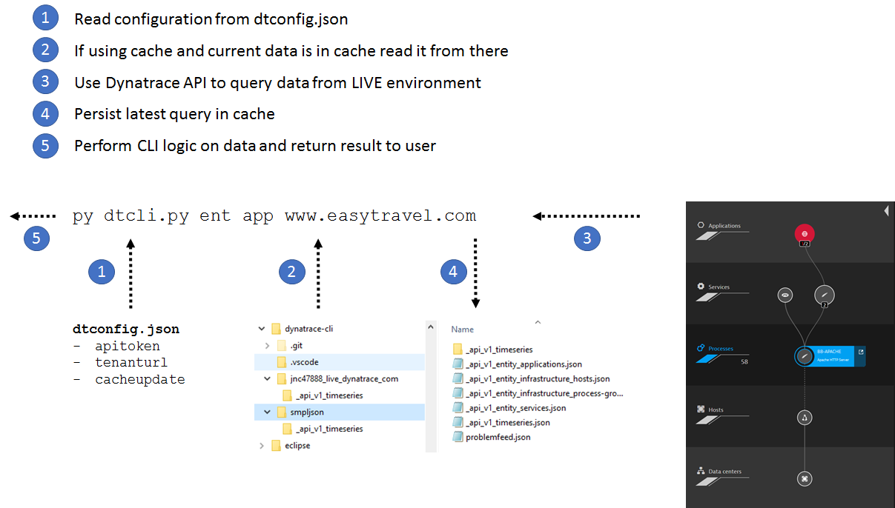
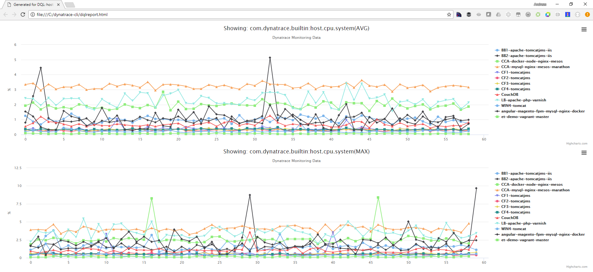

# Dynatrace CLI (Command Line Interface)
This Python based CLI makes it easy to access the Dynatrace API (both SaaS and Managed). Besides accessing the underlying API the CLI also implements some DevOps specific use cases that allows you to automate Dynatrace into your DevOps Delivery Pipeline.

The CLI also caches queried data (Smartscape and Timeseries) on the local disk. This allows you to execute multiple queries against Smartscape without the roundtrip to the Dynatrace API. It also allows you to work "offline". The GitHub repo includes a cached version of our Dynatrace Demo environment API output. This allows you to explore and test most of the supported use cases without having access to a Dynatrace Tenant.

Here is a schematic overview of how the CLI works:


And here is a sample HTML report that can be generated with the DQL (Dynatrace Query Language) report option:
```
> py dtcli.py dqlr host tags/AWS:Name=et-demo.* host.cpu.system[max%hour],host.cpu.system[avg%hour]
Generated report for host tags/AWS:Name=et-demo.* host.cpu.system[max%hour],host.cpu.system[avg%hour] in: dqlreport.html
```


## Supported Use Cases:
* Query Smartscape entities (host, process group, service, app) by any property, e.G: Display Name, Technology Type, Tag, ...
* Query timeseries data for one or multiple entities and metric types -> using DQL (Dynatrace Query Language)
* Generate HTML Reports of timeseries data based on DQL Query
* Push Custom Events (Deployments, Configuration Changes, Test Events, ...) to monitored entities
* Define Custom Tags for entities
* Monitoring as Code: Enforce monspec.json in your Continuous Delivery Pipeline
* (TBD) Access Dynatrace problem details and add comments
* (TBD) Push Custom Metrics

## Requirements:
* Python 3 Runtime: [Download](https://www.python.org/downloads/)
* Install Requests Package: pip install requests
* Dynatrace Tenant: [Get your Saas Trial Tenant](http://bit.ly/dtsaastrial)

# Trying it yourself
The easiest to get started is simply checking out this Git repo and install Python. By default the CLI will access cached data in the smpljson directory. Validate that the CLI works for you by executing the following sample
```
> py dtcli.py ent app .*easyTravel.*
['MOBILE_APPLICATION-752C288D59734C79']
```

*Using it on Linux*: I heard that instead of py or python you may have to use pyhton3 to execute the script successfully. that would then be
```
> python3 dtcli.py ent app .*easyTravel.*
['MOBILE_APPLICATION-752C288D59734C79']
```

Alright - now we are ready. Here are more examples and a brief overview of the CLIs capabilities

## Examples
The CLI assumes the following commands
py dtcli.py \<command\> \<options\>

command: 
* config: configure dynatrace tenant, token and cache strategy
* ent: query entities: app(lication), srv (services, pg (process groups), host
* ts: list availabbly metric types and query timeseries data
* prob: access problem information
* evt: push and access custom events, e.g: deployments
* dql: Dynatrace Query Language: a more convenient way to query timeseries data for certain entities ina  single command line

option: that really depends on the command. Best is to ask for help to get more details:

```
> py dtcli.py config help
> py dtcli.py ent help
> py dtcli.py ts help
> py dtcli.py dql help
```

## Examples: Configuration
Please have a look at the first two configuration examples where I show how to configure a SaaS and a Managed URL. Both URLs are slightly different.

```
> py dtcli.py config apitoken MYTOKENFORMYTENANT tenanthost mytenant.live.dynatrace.com
Current configuration stored in dtconfig.json

> py dtcli.py config apitoken MYTOKENFORMYTENANT tenanthost mytenant.dynatrace-managed.com/e/abcdef-1111-2222-3333-5cdad722e1b8
Current configuration stored in dtconfig.json

> py dtcli.py config cacheupdate 5
Current configuration stored in dtconfig.json

> py dtcli.py config revert
Reverting back to local cached demo environment. Remember: only read-only operations work
Current configuration stored in dtconfig.json

> py dtcli.py config tenanthost smpljson cacheupdate -1
Current configuration stored in dtconfig.json
FYI - This is the same as revert: Always using cache from cache directory smpljson
```

## Examples: Query Entities
```
> py dtcli.py ent app .*easyTravel.*
['MOBILE_APPLICATION-752C288D59734C79']

> py dtcli.py ent srv JourneyService
['SERVICE-CDEB60C48DE58E80', 'SERVICE-97EA6CCFEC367EC5', 'SERVICE-A9E9962F2DE6F4BC']

> py dtcli.py ent host tags/AWS:Category?value=DEMOABILITY
['HOST-F5D85B7DCDD8A93C', 'HOST-54AA0D8B5401A1C2', 'HOST-A02BF7E1B9ADA36D', 'HOST-7453A7E317FCF4AF', 'HOST-76FAA6DC0347DA12', 'HOST-6B659DFBAC76F491', 'HOST-7344649A8D974E74', 'HOST-EA50C80CC9354652', 'HOS
T-DE6F9EC80D4D7C58', 'HOST-0788564003D72AEF', 'HOST-1E64E15558B9486B', 'HOST-E662F28EFFC7D77D']

> py dtcli.py ent host tags/AWS:Name=.* value
['et-demo-1-win1', 'et-demo-1-win2', 'et-demo-1-lnx6', 'et-demo-1-lnx7', 'et-demo-1-lnx2', 'et-demo-1-lnx3', 'et-demo-1-lnx4', 'et-demo-1-lnx5', 'et-demo-1-win3', 'et-demo-1-lnx1', 'et-demo-1-win4', 'et-de
mo-1-lnx8']

> py dtcli.py ent srv serviceTechnologyTypes=ASP.NET discoveredName
['dotNetBackend_easyTravel_x64:9010', 'dotNetFrontend_easyTravel_x64:9000', 'eT-demo1-weather-express', 'eT-demo1-weather-service-restify']

> py dtcli.py ent app .\*easyTravel.\* displayName
['easyTravel Demo']

> py dtcli.py ent app .\*easyTravel.\* entityId
['MOBILE_APPLICATION-752C288D59734C79']
```

## Examples: Query Timeseries
```
> py dtcli.py ts list .*response.*
['ruxit.jmx.appserver.jetty:responsesBytesTotal', 'com.dynatrace.builtin:servicemethod.requestspermin', 'com.dynatrace.builtin:servicemethod.responsetime']

> py dtcli.py ts list .*response.* displayName
['responsesBytesTotal', 'Method response time', 'Method response time']

> py dtcli.py ts list dimensions=APPLICATION
['com.dynatrace.builtin:app.errorcount', 'com.dynatrace.builtin:app.jserrorsduringuseractions', 'com.dynatrace.builtin:app.jserrorswithoutuseractions', 'com.dynatrace.builtin:app.useractionduration', 'com.
dynatrace.builtin:app.useractionsperminute', 'com.dynatrace.builtin:appmethod.errorcount', 'com.dynatrace.builtin:appmethod.useractionduration', 'com.dynatrace.builtin:appmethod.useractionsperminute']

> py dtcli.py ts describe com.dynatrace.builtin:appmethod.useractionsperminute
{'displayName': 'com.dynatrace.builtin:appmethod.useractionsperminute', 'types': [], 'unit': 'count/min', 'timeseriesId': 'com.dynatrace.builtin:appmethod.useractionsperminute', 'aggregationTypes': ['COUNT
'], 'filter': 'BUILTIN', 'dimensions': ['APPLICATION_METHOD']}

> py dtcli.py ts query com.dynatrace.builtin:appmethod.useractionsperminute[count%hour]
{'APPLICATION_METHOD-0A1EF133D2225DE3': {'unit': 'count/min', 'dataPoints': [[1501779420000, 9.0], [1501779480000, 5.0], [1501779540000, 4.0], [1501779600000, 5.0], [1501779660000, 8.0], [1501779720000, 4.
0], [1501779780000, 3.0], [1501779840000, 5.0], [1501779900000, 4.0], [1501779960000, 7.0], .........

> py dtcli.py ts query com.dynatrace.builtin:app.useractionduration[avg%hour] APPLICATION-F5E7AEA0AB971DB1
{'APPLICATION-F5E7AEA0AB971DB1': {'timeseriesId': 'com.dynatrace.builtin:app.useractionduration', 'dataPoints': [[1501779960000, 4474862.904109589], [1501780020000, 6921639.344262295], [1501780080000, 4273
398.5], [1501780140000, 5725744.966442953], [1501780200000, 4575715.764705882], [1501780260000, 6323631.719298245], [1501780320000, 4294378.218487395], [1501780380000, .......

```

## Examples: Pull and Push Events
```
> py dtcli.py evt query from=60 to=0
{'events': [{'endTime': 9223372036854775807, 'eventId': 6644203702249079783, ...

> py dtcli.py evt query from=60 to=0 host .*demo.*
['HOST-776CE98524279B25']
{'events': [{'impactLevel': 'INFRASTRUCTURE', 'deploymentVersion': '1.0', 'eventId': -6917847702530309177, 'entityName': None, 'source': 'Dynatrace CLI', 'tags': None, 'entityId': 'HOST-776CE98524279B25',
'severityLevel': None, 'endTime': 1503350534000, 'eventType': 'CUSTOM_DEPLOYMENT', 'startTime': 1503350534000, 'eventStatus': 'CLOSED', 'deploymentName': 'My Custom Deployment'}]}
 
> dtcli.py evt query entityId=APPLICATION-F5E7AEA0AB971DB1
{'events': [{'endTime': 9223372036854775807, 'eventId': 6644203702249079783, ...

> py dtcli.py evt push host .*demo.* deploymentName=My%20Custom%20Deployment deploymentVersion=1.0 source=Dynatrace%20CLI
{'end': '1503350534000', 'customProperties': {}, 'deploymentVersion': '1.0', 'eventType': 'CUSTOM_DEPLOYMENT', 'start': '1503350534000', 'source': 'Dynatrace CLI', 'deploymentName': 'My Custom Deployment',
 'attachRules': {'entityIds': ['HOST-776CE98524279B25']}}
{'storedEventIds': [-6917847702530309177]}
```

## Examples: Define custom tags for entities
```
> py dtcli.py tag app .*easyTravel.* easyTravelAppTag

> py dtcli.py tag srv JourneyService journeyServiceTag,serviceTag

> py dtcli.py tag app entityId=APPLICATION-F5E7AEA0AB971DB1 easyTravelAppTag
```

## Examples: Dynatrace Query Language (DQL)

The DQL (Dynatrace Query Language) can either be used to query the raw JSON data. You can also replace the command "dql" with "dqlr" which will generate an HTML report based on the HTML templates in the report subdirectory. An example of that report can be seen at the beginning of this readme

```
> py dtcli.py dql app www.easytravel.com app.useractions[count%hour],app.useractionduration[avg%hour]
[{'APPLICATION-F5E7AEA0AB971DB1': {'entityDisplayName': 'www.easytravel.com', 'timeseriesId': 'com.dynatrace.builtin:app.useractions', 'dataPoints': [[1501788420000, 103.0], [1501788480000, 143.0], [150178
8540000, 130.0], [1501788600000, 143.0], [1501788660000, 120.0], [1501788720000, 156.0], [1501788780000, 118.0], [1501788840000, 102.0], [1501788900000, 106.0], [1501788960000, 70.0], [1501789020000, 110.0
], [1501789080000, 115.0], [1501789140000, 145.0], [1501789200000, 139.0], [1501789260000, 137.0], [1501789320000, 115.0], [1501789380000, 140.0], [1501789440000, 98.0], [1501789500000, 105.0], [1501789560
000, 141.0], [1501789620000, 112.0], [1501789680000, 123.0], [1501789740000, 123.0], [1501789800000, 144.0], [1501789860000, 118.0], [1501789920000, 128.0], [1501789980000, 118.0], [1501790040000, 86.0], [

> py dtcli.py dql appmethod .*Book.* appmethod.useractionduration[avg%hour]
[{'APPLICATION_METHOD-6ED7F83A1EF195DC': {'dataPoints': [[1501792560000, 985400.0], [1501792620000, 605600.0], [1501792680000, 2759333.3333333335], [1501792740000, 445333.3333333333], [1501792800000, 54000
0.0], [1501792860000, 3709000.0], [1501792920000, 727200.0], [1501792980000, 1670800.0], [1501793040000, 791666.6666666666], [1501793100000, 372200.0], [1501793160000, 1700500.0], [1501793220000, 636285.71
42857143], [1501793280000, 989250.0], [1501793340000, 1517000.0], [1501793400000, 872250.0], [1501793460000, 893750.0], [1501793520000, 358333.3333333333], [1501793580000, 324000.0], [1501793640000, 953000 ...

> py dtcli.py dqlr host tags/AWS:Name=et-demo.* host.cpu.system[max%hour],host.cpu.system[avg%hour]
Generated report for host tags/AWS:Name=et-demo.* host.cpu.system[max%hour],host.cpu.system[avg%hour] in: dqlreport.html
```


## Examples: Monitoring as Code (monspec)

To learn more about the concept of Monitoring as Code check out the material around the [Unbreakable Delivery Pipeline](https://www.dynatrace.com/news/blog/unbreakable-devops-pipeline-shift-left-shift-right-self-healing/). 
The CLI now implements the main uses to gather and compare metrics as part of your CI/CD Delivery Pipeline. All gathered and compared data will end up as a Custom Device with Custom Metrics in Dynatrace, e.g: "My Jenkins Pipeline" with metrics such as "Response Time", "Throughput" or "Number of Incoming Dependencies". 
The CLI requires two configuration files for which you can find sample definitions in the monspec subfolder:
* smplmonspec.json: defines the entity (APPLICATION, SERVICE, PROCESS, HOST) that you want to monitor, the environments where these entities are deployed, comparison definitions as well as a set of key performance metrics (=Performance Signature) that should be validated each time you call the CLI
* smplpipelineinfo.json: describes the pipeline or tool that calls the CLI. This information will define the Custom Device

Here now the set of calls to use to integrate with your CI/CD Pipeline:
```
> py dtcli.py monspec init monspec/smplmonspec.json monspec/smplpipelineinfo.json
Creates the Custom Device based on smplpipelineinfo.json and all custom metrics based on smplmonspec and the perfsignature definition
Output: {"customDevice" : "CUSTOM-DEVICE-1234", "createMetrics" : 6}

> py dtcli.py monspec remove monspec/smplmonspec.json monspec/smplpipelineinfo.json
Removes the custom metric defintions and all its data: BE CAREFUL: this will remove all previous data from previous runs!
Output: {"deletedMetrics" : 6}

> py dtcli.py monspec pull monspec/smplmonspec.json monspec/smplpipelineinfo.json SampleJSonService/Staging 60 0
Queries all perfsignature metrics defined for the SampleJSonService in the Staging Environment for the last 60 minutes. The last two parameters define timespan (e.g: 60) and timeshift from now (e.g: 0=Now, 60=60 Minutes ago, ...)
Results will only be printed on the console. NO DATA WRITTEN TO DYNATRACE!
Output: { "performanceSignature" : [ {"timeseries": "com.dynatrace.builtin:service.responsetime", "result" : 1234, .... } ], "comment" : "Pulled metrics for SampleJSonService/Staging"}

> py dtcli.py monspec push monspec/smplmonspec.json monspec/smplpipelineinfoo.json SampleJSonService/Staging 60 0
Same as "dtcli monspec pull" but metrics will be written to the Dynatrace Custom Device for your Pipeline.
Suggestion: call this from your pipeline at the end of your test runs or even throughout your test run to pull in current metrics and store them on the custom device
Output: { "performanceSignature" : [ {"timeseries": "com.dynatrace.builtin:service.responsetime", "result" : 1234, .... } ], "comment" : "Pushed metrics for SampleJSonService/Staging"}

> py dtcli.py monspec base monspec/smplmonspec.json monspec/smplpipelineinfo.json SampleJSonService/Staging 60 60
Sets custom thresholds for each metric defined in monspec. The data is taken from the defined environment and timeframe, e.g: from Staging 60 minutes 60 minutes ago. 
Suggestion: This is useful if you have a reference timeframe and environment and you want these values to be your baseline (=threshold). Once set it means that Dynatrace will automatically open Problem Tickets once you "dtcli monspec push". 
Output: { "performanceSignature" : [ {"timeseries": "com.dynatrace.builtin:service.responsetime", "result" : 1234, .... } ], "comment" : "Pushed theshold definition for SampleJSonService/Staging"}

> py dtcli.py monspec pullcompare monspec/smplmonspec.json monspec/smplpipelineinfo.json SampleJSonService/ProductionToStaging 60
pullcompare will look at the passed comparision, e.g: ProductionToStaging. It will pull in the metrics for the "compare" environment, and then calcultes the baseline (=thresholds) on every custom device based on these values but also factoring in the scalefactor definition. 
After that it queries the "source" environment, compares the values with the calculated baseline and calculates how many violations you had.
All results for each perfsignature metric will be printed on the console. NO DATA WRITTEN TO DYNATRACE!
Output: { "performanceSignature" : [ {"timeseries": "com.dynatrace.builtin:service.responsetime", "result" : 1234, "result_compare" : 1100, "threshold" : 1200, "violation" : 1.... } ], "totalViolations" : 1, "comment": "Pulled compare for SampleJSonService/ProductionToStaging 60"}

> py dtcli.py monspec pullcompare monspec/smplmonspec.json monspec/smplpipelineinfo.json SampleJSonService/ProductionToStaging 60 0 0
This is another variation of pullcompare where you can overwrite the values for shiftcomparetimeframe & shiftsourcetimeframe
Output: { "performanceSignature" : [ {"timeseries": "com.dynatrace.builtin:service.responsetime", "result" : 1234, "result_compare" : 1100, "threshold" : 1200, "violation" : 1.... } ], "totalViolations" : 1, "comment": "Pulled compare for SampleJSonService/ProductionToStaging 60 0 0"}

> py dtcli.py monspec pushcompare monspec/smplmonspec.json monspec/smplpipelineinfo.json SampleJSonService/ProductionToStaging 60
Same as "dtcli monspec pullcompare" but in this case actually pushes the thresholds back to Dynatrace followed by pushing the actual values. If there are any violations it will also open a problem ticket in Dynatrace. 
Output: { "performanceSignature" : [ {"timeseries": "com.dynatrace.builtin:service.responsetime", "result" : 1234, "result_compare" : 1100, "threshold" : 1200, "violation" : 1.... } ], "totalViolations" : 1, "comment": "Pushed compare for SampleJSonService/ProductionToStaging"}

> py dtcli.py monspec pushcompare monspec/smplmonspec.json monspec/smplpipelineinfo.json SampleJSonService/ProductionToStaging 60 0 60
This is another variation of pullpush where you can overwrite the values for shiftcomparetimeframe & shiftsourcetimeframe
Output: { "performanceSignature" : [ {"timeseries": "com.dynatrace.builtin:service.responsetime", "result" : 1234, "result_compare" : 1100, "threshold" : 1200, "violation" : 1.... } ], "totalViolations" : 1, "comment": "Pushed compare for SampleJSonService/ProductionToStaging"}

> py dtcli.py monspec pushdeploy monspec/smplmonspec.json monspec/smplpipelineinfo.json SampleJSonService/Staging Job123Deployment v123
Creates a Deployment Event for all entities matching Staging
Suggestion: Call this from your pipeline after deploying your new build. You will see the deployment and build information in Dynatrace
Output : { "event" : { "eventId" : "ADBC", ...}}

```